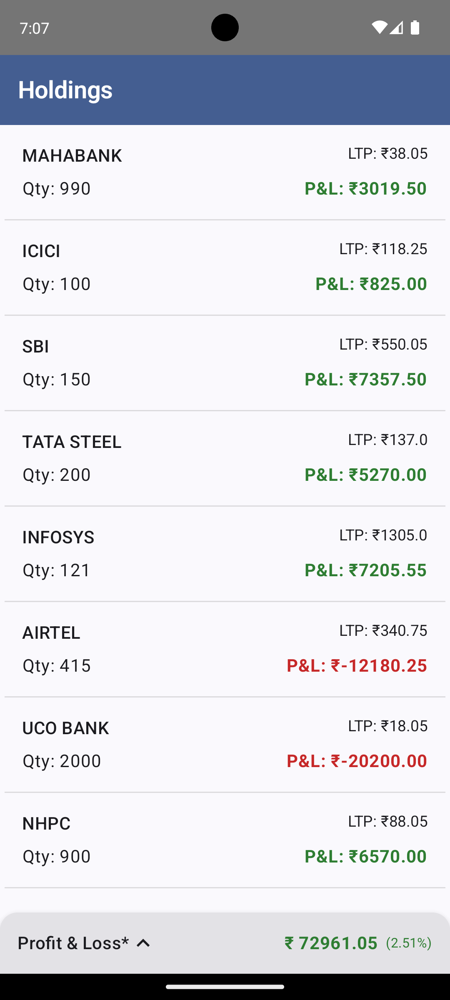
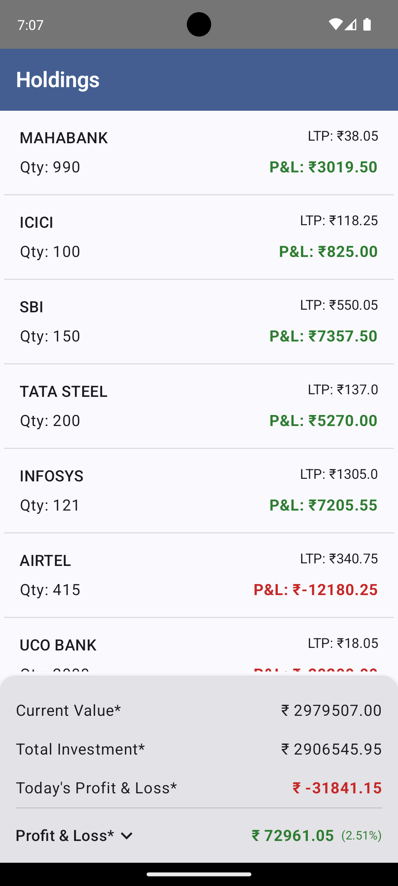
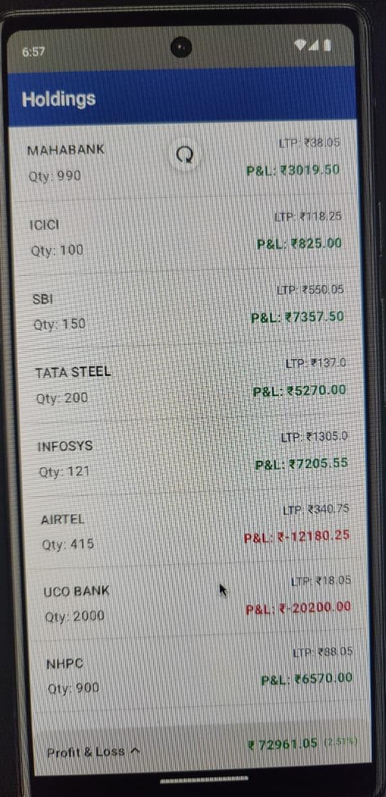
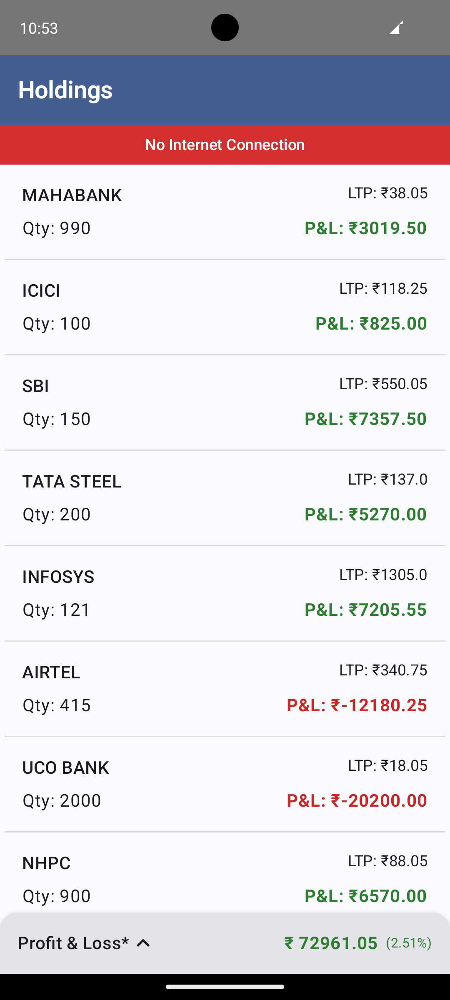
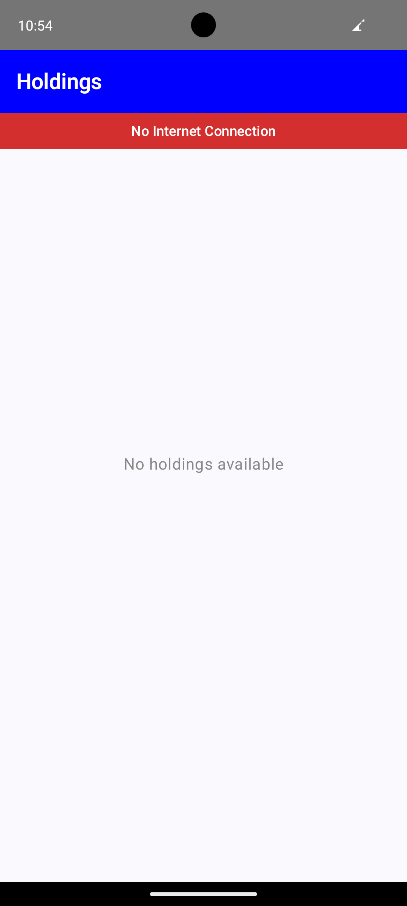

# Holdings Portfolio App (Android)

## Overview
This Android application displays a list of stock holdings along with a portfolio summary.  
It supports showing **stock holdings**,  **expand/collapse summary**, **pull-to-refresh**, and **offline access**, and is built using **Jetpack Compose** following **MVVM + Clean Architecture principles**.

The focus of this implementation is **code quality, scalability, testability, and performance**, aligned with the assignment guidelines.

## Features
- Display list of stock holdings
- Portfolio summary with **expand / collapse animation**
- Pull-to-refresh to fetch the latest data (to refresh local db with network data)
- Offline support using local DB
- Error handling
- Expand/Collapse view Animations using Jetpack Compose
- Portrait-only orientation (intentional scope decision)

## Screenshots & Demo

> Screenshots and GIFs are placed under the `screenshots/` directory.

### Holdings List


### Portfolio Summary (Expanded)


### Pull to Refresh


### No internet


### No data



## 🏗 Architecture
The app follows **MVVM inspired by Clean Architecture**, ensuring clear separation of concerns and testable business logic.

```
app/
├── src/
│   ├── main/
│   │   ├── java/com/sumedh/demo/
│   │   │   │── common/
│   │   │   ├── di/
│   │   │   ├── data/
│   │   │   │   ├── local/
│   │   │   │   │   ├── dao/
│   │   │   │   │   ├── entity/
│   │   │   │   │   └── AppDatabase.kt
│   │   │   │   ├── remote/
│   │   │   │   │   ├── api/
│   │   │   │   │   └── dto/
│   │   │   │   └── repository/
│   │   │   │   └── network/
│   │   │   ├── domain/
│   │   │   │   ├── model/
│   │   │   │   ├── repository/
│   │   │   │   └── usecase/
│   │   │   │   └── error/
│   │   │   ├── ui/
│   │   │   │   ├── components/
│   │   │   │   ├── state/
│   │   │   │   │── viewModel/
│   │   │   │   └── theme/
│   │   │   ├── MainActivity.kt
│   │   │   └── SumedhDemoApplication.kt
│   │   │
│   │   └── res/
│   │       └── AndroidManifest.xml
│   ├── test/
│   │   └── java/com/sumedh/demo/
│   │       ├── domain/
│   │       └── viewmodel/
│   │
│   ├── androidTest/
│   │   └── java/com/sumedh/demo/
│   │       └── ui/

```

## Tech Stack
- **Language**: Kotlin -> v2.1.10
- **UI**: Jetpack Compose (Material 3)  -> v1.7.2
- **Architecture**: MVVM + Clean Architecture
- **State Management**: StateFlow
- **Dependency Injection**: Hilt -> v2.51.1
- **Async**: Coroutines & Flow -> v1.9
- **Persistence**: Room -> v2.7.1
- **Testing**: JUnit, Compose UI Test
- **Min SDK**: 23

## Offline Support
- Holdings data is cached locally using Room DB
- Cached data is shown when the device is offline
- Network errors are handled gracefully
- Room DB data is a single source of truth to show data

## UI & UX
- UI built entirely using Jetpack Compose
- LazyColumn used for efficient list rendering
- Added expand/collapse animation
- Material 3 theming for consistent appearance
- Orientation locked to portrait mode

## State Management
- Single source of truth via HoldingsUiState
- State collected using collectAsStateWithLifecycle
- No UI state stored inside composables
- ViewModel manages all UI logic

## Testing
### Unit Tests
- ViewModel logic
- UseCase behaviour
- Data mapping and portfolio calculations

### UI Tests
- Holdings list rendering
- Portfolio summary expand/collapse
- Pull-to-refresh callback invocation
- All tests are deterministic and pass successfully.

## Error Handling
- Network errors are handled gracefully and do not crash the app
- Cached data is shown when available during network failures
- UI reflects error states via a dedicated error view
- ViewModel exposes error information as part of the UI state
- All error-handling logic is kept outside composables

This approach ensures predictable UI behaviour and keeps the UI layer
stateless and easy to test.

## Performance Notes
Performance characteristics were observed during development using Android Studio profilers.
- Cold start time: ~600–700 ms (Debug build)
- No continuous memory growth during repeated scrolling
- Smooth scrolling using LazyColumn
- Minimal recompositions due to stateless composables and stable list keys
- Metrics may vary based on device, OS version, and build configuration.

## Trade-offs & Scope Decisions
The following were intentionally kept out of scope as they were not required by the assignment:
- Tab bar navigation (explicitly mentioned to ignore)
- Search functionality
- Sorting functionality
- Landscape orientation support
The architecture supports easy extension for these features in the future.

## How to Run
1. Clone the repository
2. Open the latest Android Studio
3. Sync Gradle
4. Run on emulator or device (API 23+)

## Evaluation Checklist
- Clean & scalable architecture
- SOLID principles followed
- Offline support
- Error handling
- Animations
- Unit & UI tests
- Performance awareness
- Minimal third-party dependencies
  
